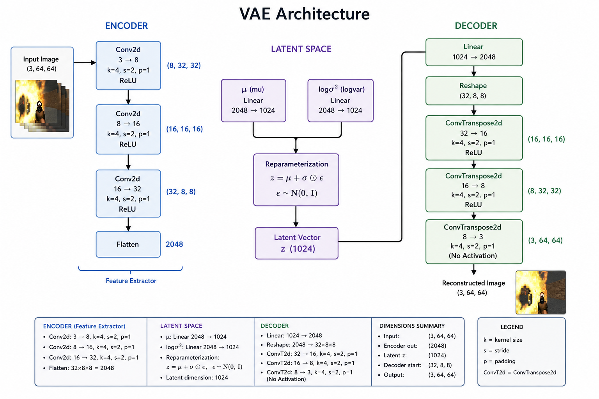
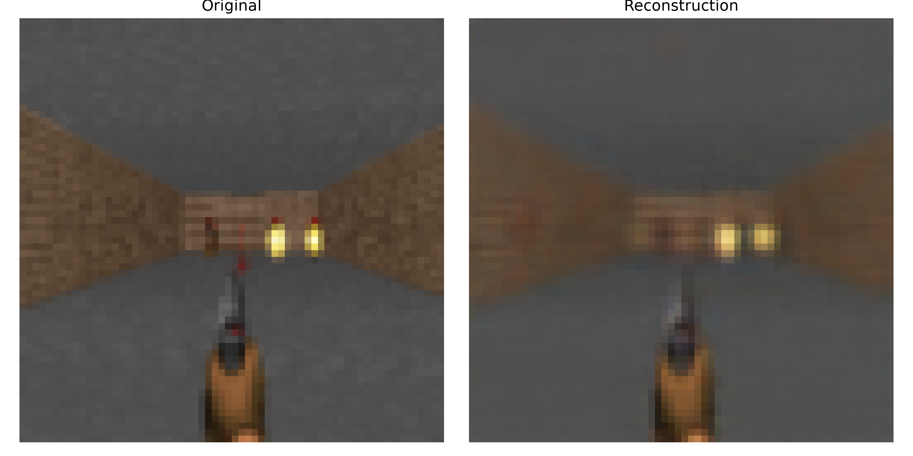
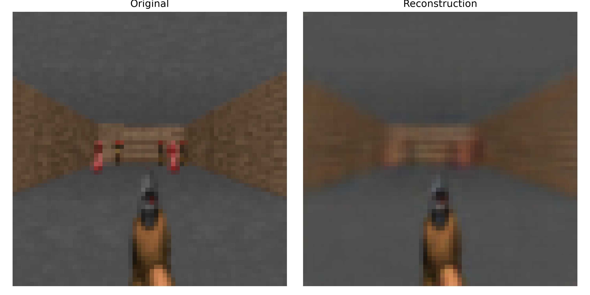

# vizdoom-world-model

Implementation of vizdoom world model taking inspiration of the [Original World Models Paper by David Ha, Jürgen Schmidhuber](https://arxiv.org/pdf/1803.10122). Built with pytorch and uv.

## To setup the project
```sh
git clone https://github.com/NeoDrags/vizdoom-world-model
uv sync
```

## Training the model
Parameters are stored in `config.yaml`.

```sh
uv run training/train_vae_rnn.py
```
---
## Model Architecture

We broadly divide our model into 3 parts. VAE, MDNRNN and the Controlller. Each part has been described.

### VAE

<center>The vae model architecture is as listed below.</center>


<details>

<summary> Some visualized images </summary>
<center>Image 1</center>


<center>Image 2</center>


</details>
